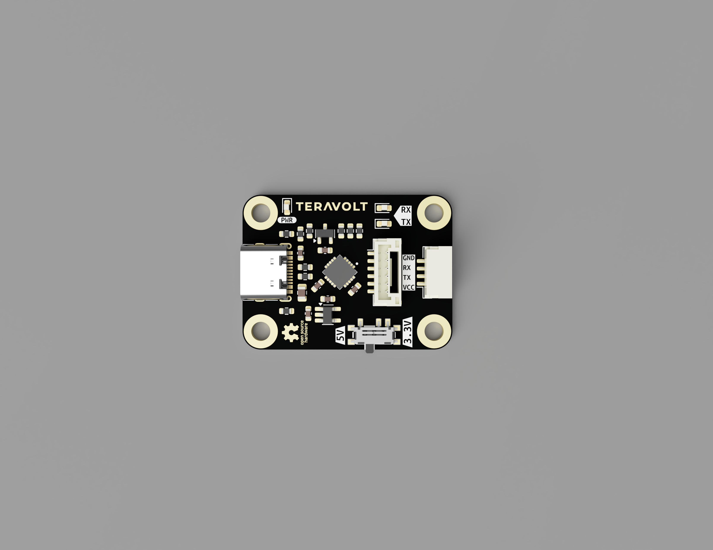

# USB to TTL Converter — FT231XQ-R

A compact, reliable, and versatile **USB to UART** converter designed with the **FT231XQ-R** chipset. This open hardware project features dual voltage operation, UART activity LEDs, and dual JST-GH connectors to support a wide range of embedded development and debugging workflows.

---

## Features

- ✅ Based on **FTDI FT231XQ-R** (USB to UART bridge)
- ✅ **USB Type-C** connector for modern compatibility
- ✅ Selectable I/O voltage: **3.3V / 5V** via slider switch
- ✅ **TX/RX activity LEDs** for visual communication debug
- ✅ **Power LED** indicator
- ✅ Two **JST-GH** connectors:
  - **4-pin**: VCC, TX, RX, GND
  - **6-pin**: RST, RX, TX, VCC, CTS, GND
- ✅ Compact and easy to integrate
- 🔒 **Non-commercial Open Hardware License**

---

## 🔧 Specifications

| Parameter                 | Details                          |
|--------------------------|----------------------------------|
| USB Interface            | USB Type-C                       |
| USB-UART Chip            | FT231XQ-R                        |
| Logic Level              | Selectable 3.3V or 5V            |
| Status Indicators        | TX, RX, Power (LEDs)             |
| Connectors               | JST-GH 4-pin & 6-pin             |
| UART Signals             | TX, RX, CTS, RST                 |
| Board Size               | ~35mm × 25mm      |

---

## Pinouts

### 4-Pin JST-GH Connector

| Pin | Function | Description            |
|-----|----------|------------------------|
| 1   | VCC      | Selected voltage (3.3V/5V) |
| 2   | TX       | UART Transmit (from USB) |
| 3   | RX       | UART Receive (to USB)    |
| 4   | GND      | Ground                  |

### 6-Pin JST-GH Connector

| Pin | Function | Description           |
|-----|----------|-----------------------|
| 1   | RST      | Reset (active low)    |
| 2   | RX       | UART Receive          |
| 3   | TX       | UART Transmit         |
| 4   | VCC      | 3.3V or 5V (selected) |
| 5   | CTS      | Clear to Send         |
| 6   | GND      | Ground                |

---

## Driver Installation

### Windows

1. Download the VCP driver from: [https://ftdichip.com/drivers/](https://ftdichip.com/drivers/)
2. Install and plug in the device
3. COM port will appear in **Device Manager**

### macOS

- No driver required for modern versions
- Optional FTDI VCP driver available on FTDI website

### Linux

- Plug-and-play with most distributions
- Check with `dmesg | grep ttyUSB`

---

## License

**Custom Non-Commercial Open Hardware License**

> You are free to use, modify, reproduce, and distribute this hardware **for non-commercial purposes only**, provided that you give **proper credit** and include a copy of the license.

Full terms in [`LICENSE.txt`](./Licence.txt)

---

## Credits

Designed and developed by [TeraVolt Labs](https://www.linkedin.com/company/teravoltlabs)  
Powered by **FTDI FT231XQ-R**

---

## Support & Contributions

This is an open hardware project. Feel free to open issues, suggest improvements, or fork and build your own versions (non-commercially).

---

## Documentation
Official Documentation can be found at: [GitBook](https://teravolt.gitbook.io/teravolt/peripherals/usb-to-ttl-converter)